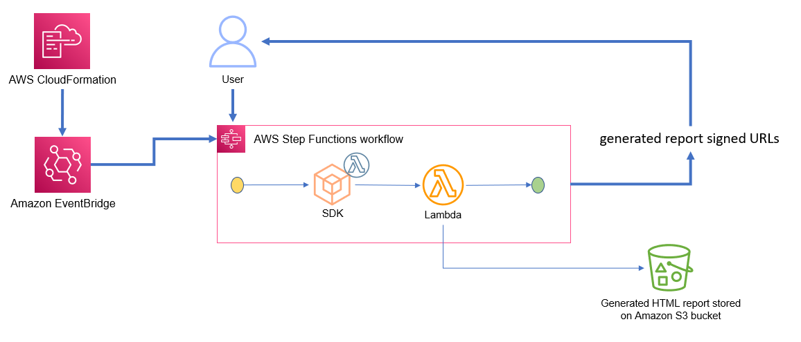

# Serverless Operational Review Tool

This tool has been created to help evaluate **AWS Serverless services** in bulk and to automatically generate a full review report which aims to assist in customer resource analysis.

**Tool versions with changelog are present [here](VERSIONS.md).**

## Currently supported features

- **AWS Lambda**
  - Risk Warnings:
    - Multi-AZ warnings evaluate if a function is VPC enabled and if the linked subnets follow multi-AZ approach.
    - Runtime warnings evaluate if a function runtime is older then latest or two latest runtime versions (only Zip type supported)
    - **AWS Trusted Advisor checks** (the following checks are included as part of the report if the AWS Account has [AWS Trusted Advisor](https://docs.aws.amazon.com/awssupport/latest/user/trusted-advisor.html)  enabled):
      - Functions with high error rates
      - Functions with excessive timeouts
  
  - Optimization Recommendations:
    - Provides optimization recommendations focused on function memory and benefits of optimizing (duration and cost).
      - This information is pulled from AWS Compute Optimizer so there has to be historical usage available.
    - Lists functions using x86 architecture type and recommends converting to arm64 (Graviton2).

  - List of reviewed functions:
    - Provides the list of reviewed functions with their configuration as well as Event Source Mapping configuration (if present).

## Architecture



This tool is using an event-driven approach to automatically trigger resource review right after successful deployment. Secondary review can be run using a manual trigger of the AWS Step Functions state machine.

## User guide

### Step 1 - Deployment

- Install [AWS SAM CLI](https://docs.aws.amazon.com/serverless-application-model/latest/developerguide/install-sam-cli.html)

- Clone this repository to your local machine, which can access your AWS account containing the resources you would like to review (you may need to configure [AWS CLI credentials](https://docs.aws.amazon.com/cli/latest/userguide/cli-chap-configure.html))

- Execute `sam build` command from the root folder - this will build and package a deployable bundle.

- Execute `sam deploy --guided` command and pass the following parameters in the terminal:

  - Stack Name [sam-app]: ops-review
  - AWS Region [region]: **Select the region where your resources are located**.
  - Parameter IsTrustedAdvisorEnabled [True]: If the target AWS Account has AWS Trusted Advisor **enabled**, set this parameter set to `true` for additional checks. In case the AWS Trusted Advisor is **not enabled** for the target AWS Account, please set this parameter to `false`.
  - Parameter Functions [All]: Leave this parameter as defaul `All` to run a review of all functions in the region **OR** pass a **commadelimited list of function names you would like to review** (up to 40 supported).
  - The rest of the configuration can be left with defaults.

- This process will trigger AWS CloudFormation stack deployment within your selected account. ONce the deployment is complete, the review and the report generation process will begin automatically so there is no need to trigger it.

### Step 2 - Review reports

- Open the [AWS Step Functions console](https://console.aws.amazon.com/states/home) and locate the deployed state machine - its name will be provided in the terminal outputs after SAM CLI completes deployment or it can be found within Outputs tab of the deployed CloudFormation stack in CloudFormation console.
- Locate the latest execution withing the **Executions** section and click on it to open it.
- Navigate to the list of events and locate the **last** execution event called **ExecutionSucceeded** or you can click on the last execution stap in the workflow diagram. The body of this event will contain an S3 presigned URL (valid for an hour), that can be used to access the generated reports.
- Copy the presigned URL and paste it into a browser to download the report file.
- ALternatively you can access the report.html file from every run in past 14 days from the deployed S3 bucket (can be located through the CloudFormation Stack resources or Outputs). Every run has its own timestamped folder.

#### NOTE

- **Viewing historical reports**
  - All reports and related information is saved on the ReportBucket S3 bucket within a time stamped folder (UTC time stamps).
  - These files can be accessed even if the presigned URL has expired.
  - The report is saved within report.html file within corresponding report folder.


### Triggering a report manually

- **All functions** - execute the state machine from [Step Functions console](https://console.aws.amazon.com/states/home) with default or empty input. New set of presigned URLs will be created pointing to new set of reports.
  
- **Selected functions**:
  - Check the Operational Review CloudFormation stack Parameters tab in the console, to see if a list of functions has been provided (if the value for Functions parameter is **All**, you will need to run the deployment again and pass a commadelimited list of function names into to the parameter)
  - To re-run the report for specific set of functions, the state machine input should follow the format of:

    ```
    {
      "Functions": ["function1", "function2", "function3"]
    }
    ```
    - **The list provided to the state machine doe not need to match the list provided to the deployment.**

## Resource Cleanup

- Remove all files from the deployed S3 bucket (name can be located in the CloudFormation stack Outputs)
- Delete the deployed CloudFormation stack using `sam delete` command from terminal from the deployment folder or delete the CloudFormation stack from console.

